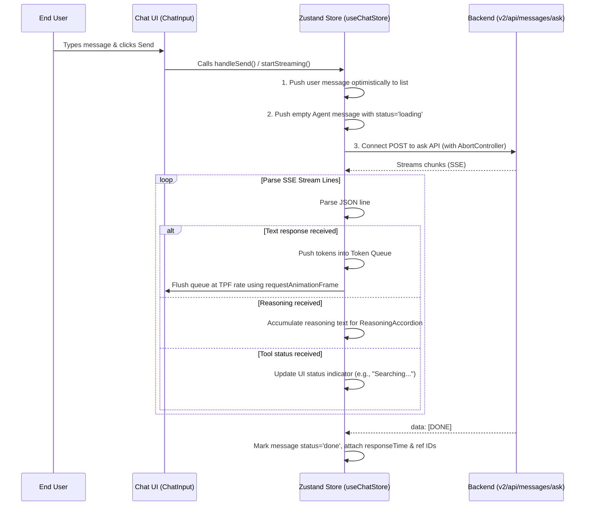

# Architecture & UX Flows - AI Agents Module

This document provides a detailed specification of the front-end architecture, directory structure, state management (Zustand & React Query), routing, and core user experience (UX) flows of the AI Agents module. This specification is designed to enable developers and AI code-generation tools to rebuild or clone this module on any technology stack.

---

## 1. Directory Structure & Routing

The AI Agents module is located within the `react/modules/ai-agents/` directory in the React SPA:

- `layout.tsx`: The main layout container containing the Sidebar component on the left and the page outlet on the right.
- `page.tsx`: The landing page when no conversation is active. It allows the user to select an Agent, views a default greeting, and accepts the first message.
- `[conversationId]/page.tsx`: The conversation detail page. It displays the conversation history, supports infinite scroll to load older messages, handles new message submissions, and manages real-time streaming responses from the Agent.
- `utils.ts`: Contains common utilities such as message block parsing, streaming state helpers, and scrollbar CSS objects.
- `_components/`: Directory for reusable UI elements:
  - `SideBar/`: Manages list rendering of Agents and Conversations (Pinned & Recents sections), searching, renaming, and deleting threads.
  - `MessageBubble/`: Renders user and Agent message containers, handling reasoning blocks accordion, shell command executions, and ratings feedback.
  - `templates/`: Houses individual UI widgets rendered from structured JSON payloads.

---

## 2. State Management

The module utilizes **Zustand** for transient UI state (e.g., streaming text, connection abort signals) and **React Query** for server state caching and synchronization.

### A. Zustand Chat Store (`react/store/chat.store.ts`)
Manages real-time streaming sessions and conversation states:

```typescript
export type ChatState = {
    conversationId?: string;                     // Active conversation ID
    messages: Message[];                         // Optimistic/streaming messages in the current session
    conversationTitle?: string;                  // Active conversation name
    redirectToConversationDetail?: string;       // Route to redirect after initiating a new conversation
    isNewConversation: boolean;                  // Flag indicating a newly initiated conversation
    isStreaming?: boolean;                       // Streaming status flag
    currentConversationId?: string;
    previousConversationId?: string;
    enableFetch: boolean;                        // Controls whether history queries should execute
    controller?: AbortController;                // Abort signal controller for streams
    agentSourceConfigs: AgentSourceConfig[];     // Active Agent's source configurations (web search, KB, etc.)
    agent: Partial<AgentDetail>;                 // Active Agent's profile detail
};
```

**Key Actions:**
- `startStreaming(payload)`: Initiates a POST stream fetch request to receive chunked responses.
- `abortStreaming()`: Aborts the active connection stream via `controller.abort()`.
- `addMessage(msg)` / `updateMessage(id, patch)` / `updateLastMessage(patch)`: Local store mutators.
- `reset()`: Wipes messages when switching between Agents or starting a new session.

### B. React Query Caches (`react/services/ai-chatbot/query.ts`)
Manages server-synchronized queries and mutations:

- `useDefaultAgent()`: Fetches the fallback agent when accessing the chat landing page.
- `useAgents(page, limit)`: Fetches pages of available agents for the Sidebar layout.
- `useAgentById(id)`: Fetches details for a specific Agent (e.g. greeting messages, prompt topics).
- `useConversations({ limit, search })`: Uses `useInfiniteQuery` to query scroll-to-load conversation lists with search capabilities.
- `usePinnedConversations()`: Queries all user-pinned conversations.
- `useConversationByIdInfinite(id)`: Loads conversation message history using infinite scroll back in time.

---

## 3. Core UX Flows

### A. Sending & Streaming Messages Flow

The message delivery uses optimistic rendering, token queueing, and a frame-rate-aligned paint loop to ensure smooth, lag-free output.



**Smooth Text Rendering Algorithm:**
1. Text chunks `{ response: "..." }` received from the stream are split into word/whitespace tokens using the regex `/\S+|\s+/g` and pushed into a `tokenQueue`.
2. A request animation frame loop (`drainQueue`) dequeues a small batch (`TPF = 1` - Tokens Per Frame) to display at a constant frame rate, mitigating rendering jitters:
   ```typescript
   const drainQueue = () => {
       rafId = null;
       if (tokenQueue.length === 0) return;
       const batch = tokenQueue.splice(0, TPF).join('');
       fullText += batch;
       get().updateLastMessage({ message: fullText, status: 'streaming' });
       if (tokenQueue.length > 0) {
           rafId = requestAnimationFrame(drainQueue);
       }
   };
   ```

### B. Conversation CRUD Operations

#### 1. Pinning & Unpinning:
- User clicks the Pin action button on a conversation item.
- Client sends `POST` / `DELETE` requests to `/v2/api/conversations/:id/pin`.
- On success, lists are invalidated.
- **Micro-interaction**: Sidebar scrolls smoothly (`scrollIntoView`) to the newly pinned/unpinned item and flashes it with a highlighted state for 2 seconds.

#### 2. Renaming:
- User inputs a new name in the renaming dialog.
- Client triggers a `PATCH` request to `/v2/api/conversations/:id`.
- **Optimistic Update**: Client updates the local cache immediately to prevent delay in UI reflection.

#### 3. Deleting:
- User triggers delete confirmation; client issues a `DELETE` request to `/v2/api/conversations/:id`.
- If the deleted thread is the currently active route, the client automatically redirects to `/ai-agents`.

### C. Smart Auto-Scrolling
Handles viewport focus during bot stream delivery:

1. **Auto-Scroll**: Scrolls to bottom of the viewport automatically during active token ingestion.
2. **User Interrupt Detection**: If the user scrolls upwards (`currentScrollTop < lastScrollTop`), the auto-scroll lock is disengaged (`shouldAutoScroll = false`) allowing them to read history uninterrupted.
3. **Scroll to Bottom Button**:
   - Appears when user scrolls up by `> 120px` from the bottom.
   - Displays a bouncing animation (`chat-bounce` three dots) if streaming is active.
   - Clicking it resets `shouldAutoScroll = true` and performs a smooth scroll back to bottom.

### D. Infinite Pagination for Chat History
1. Viewport loads the first page of messages and scrolls to the bottom of the container.
2. When the user scrolls to the top (triggering a hidden `1px` element), React Query executes `fetchNextPage`.
3. **Layout Shift Prevention**: Calculates `container.scrollHeight` difference before and after injection, incrementing `scrollTop` by this delta to maintain the reader's scroll position without page jumps.

---

## 4. Attachments Management
- **Upload**: Triggered from the input panel, calling `POST /v2/api/conversations/:id/attachments/upload` with form data.
- **Lock State**: While files are uploading or processing on the server, the message send button is disabled (`isProcessingAttachments = true`).
- **Deletion**: User clicks 'x' on the file chip, calling `DELETE /v2/api/attachments/:id` to detach the file from the thread context.
